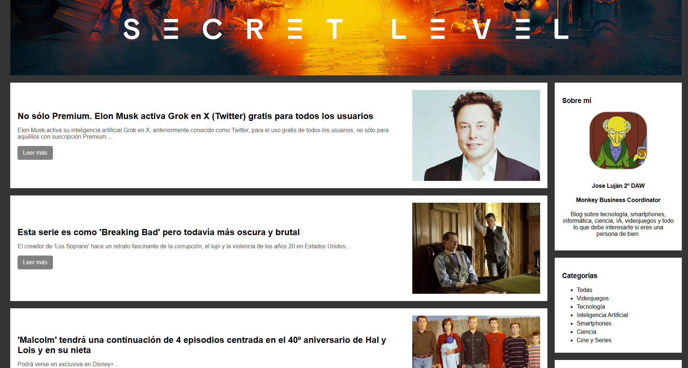

# PHP Blog - Jlm

**PHP Blog** is a personal blog project developed using PHP, HTML, CSS, and MySQL. This blog allows users to read articles organized by categories, while administrators can manage articles, categories, and users through an admin panel.

---

## Key Features

### For Users:
- **Article Reading**: Users can read published articles on the blog.
- **Categories**: Articles are organized by categories for easy navigation.
- **Pagination**: Articles are displayed in pages with a limit per page.
- **About the Author**: Section with information about the blog author.
- **Social Media**: Links to the author's social media profiles.

### For Administrators:
- **Admin Panel**: Access to a control panel to manage articles, categories, and administrators.
- **Article Management**: Create, edit, delete, and change the status of articles.
- **Category Management**: Add, edit, or delete categories.
- **Admin Management**: Add or remove administrators.
- **Authentication**: Login system to access the admin panel.

---

## Technologies Used

- **PHP**: Server-side programming language for the blog logic.
- **HTML**: Structure of the web pages.
- **CSS**: Styling for the blog's design and presentation.
- **MySQL**: Database to store articles, categories, and users.
- **PHP Sessions**: For managing user and admin authentication.

---

## Project Structure

- **index.php**: Main page of the blog where articles are displayed.
- **php/headerMain.php**: Common header for all pages.
- **php/footer.php**: Common footer for all pages.
- **php/articulos.php**: Logic to display articles on the main page.
- **php/categorias.php**: Logic to display categories in the sidebar.
- **php/administrador.php**: Admin panel to manage articles, categories, and administrators.
- **php/formulario_login.php**: Login form for administrators.
- **php/logout.php**: Logic to log out.
- **php/dbconnector.php**: Connection to the MySQL database.
- **css/styles.css**: CSS file for the blog's styles.

---

